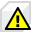
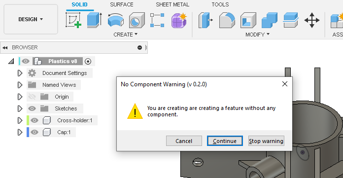

#  NoComponentWarn

A Fusion 360 add-in that warns when features are created outside components.

Currently Windows-only.

## Installation
Download the add-in from the [Releases](https://github.com/thomasa88/NoComponentWarn/releases) page.

Unpack it into `API\AddIns` (see [How to install an add-in or script in Fusion 360](https://knowledge.autodesk.com/support/fusion-360/troubleshooting/caas/sfdcarticles/sfdcarticles/How-to-install-an-ADD-IN-and-Script-in-Fusion-360.html)).

Make sure the directory is named `NoComponentWarn`, with no suffix.

## Usage

Press Shift+S in Fusion 360 and go to the *Add-Ins* tab. Then select the add-in and click the *Run* button. Optionally select *Run on Startup*.

A warning will be shown every time a new feature is created outside a component.

## Author

This add-in is created by Thomas Axelsson.

## License

This project is licensed under GPL v3 or any later version. See [LICENSE](LICENSE).