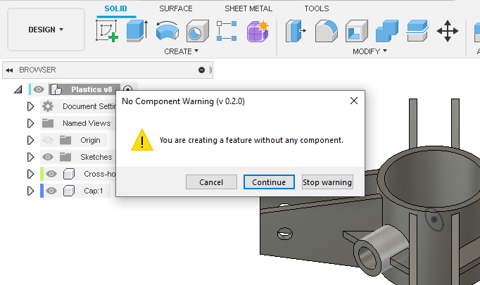

#  NoComponentWarn

A Fusion 360 add-in that warns when features are created outside components.

A warning will be shown every time a new feature is created outside a component. At that point, the user can choose to either Cancel, Continue or Stop the warning messages for the current document session.

Currently Windows-only.

## Installation
Download the add-in from the [Releases](https://github.com/thomasa88/NoComponentWarn/releases) page.

Unpack it into `API\AddIns` (see [How to install an add-in or script in Fusion 360](https://knowledge.autodesk.com/support/fusion-360/troubleshooting/caas/sfdcarticles/sfdcarticles/How-to-install-an-ADD-IN-and-Script-in-Fusion-360.html)).

Make sure the directory is named `NoComponentWarn`, with no suffix.

## Usage

Press Shift+S in Fusion 360 and go to the *Add-Ins* tab. Then select the add-in and click the *Run* button. Optionally select *Run on Startup*.

A warning will be shown every time a new feature is created outside a component.

At that point, the following choices are given:

* *Cancel* (Esc): Cancel the operation
* *Continue* (Enter): Go through with the operation and create the feature
* *Stop warning*: Go through with the operation and stop warning for this document for this session.

## Author

This add-in is created by Thomas Axelsson.

## License

This project is licensed under the terms of the MIT license. See [LICENSE](LICENSE).

## Changelog

* v 0.2.5
  * Fix: Don't double-trigger when sketch is created using button
* v 0.2.4
  * Fix: Match all plane commands
* v 0.2.3
  * Warn on construction object creation as well
  * More detailed usage instructions
* v 0.2.2
  * MIT license, for inclusion Autodesk app store
* v 0.2.1
  * Fix duplicated words in dialog text
* v 0.2.0
  * Better button labels